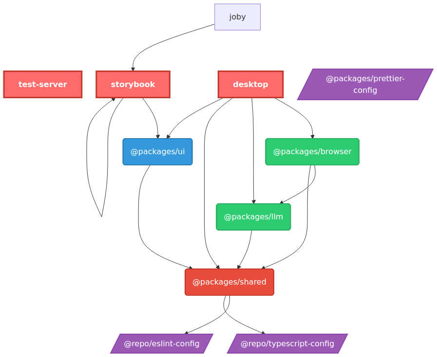

# Joby - Intelligent Job Application Assistant

An AI-powered desktop application that streamlines the job application process
by automatically detecting and filling job application forms with contextually
appropriate responses.

## Overview

Joby is a privacy-first, intelligent assistant designed to make job applications
effortless while maintaining authenticity and quality in every submission. The
system runs locally on your machine, using browser automation and AI to
transform the repetitive task of job applications into an efficient,
personalized process that improves with each use.

### Key Features

- **Intelligent Form Detection**: Automatically detects job application forms
  across major platforms
- **AI-Powered Responses**: Generates contextually appropriate responses using
  local Ollama models
- **Privacy-First Architecture**: All data stays local - no cloud dependencies
  or data sharing
- **Learning Capabilities**: Improves responses over time based on user feedback
  and patterns
- **Cross-Platform Compatibility**: Works with major ATS systems (Workday,
  Greenhouse, Lever, etc.)
- **User Control**: Complete transparency with user review and approval for all
  actions

## Technology Stack

### Core Technologies

- **[Electron](https://electronjs.org/)** - Desktop application framework
- **[React](https://react.dev/)** - UI framework with Atomic Design pattern
- **[TypeScript](https://typescriptlang.org/)** - Type safety throughout (strict
  mode)
- **[Ollama](https://ollama.ai/)** - Local AI models for response generation
- **[TailwindCSS](https://tailwindcss.com/)** - Utility-first styling
- **[Turborepo](https://turbo.build/)** - Monorepo build system

### Development Tools

- **[Vite](https://vitejs.dev/)** & **Webpack** - Build tooling
- **[Vitest](https://vitest.dev/)** - Testing framework
- **[Storybook](https://storybook.js.org/)** - Component development
- **[ESLint](https://eslint.org/)** & **[Prettier](https://prettier.io/)** -
  Code quality
- **[Husky](https://typicode.github.io/husky/)** - Git hooks for quality
  enforcement

## Project Structure

This monorepo contains the following apps and packages:

### Apps

- **`desktop`** - Main Electron application (main + renderer processes)
- **`storybook`** - Component library documentation and development environment

### Core Packages

- **`@packages/ui`** - React component library (Atomic Design pattern)
- **`@packages/browser`** - Browser automation and form analysis services
- **`@packages/llm`** - Ollama integration for AI response generation

### Configuration Packages

- **`@packages/eslint-config`** - Shared ESLint configurations
- **`@packages/typescript-config`** - Shared TypeScript configurations
- **`@packages/prettier-config`** - Shared Prettier configurations

## Package Dependencies

This diagram shows the dependency relationships between all packages and apps in
the monorepo. It is automatically generated and kept up-to-date through:

- Pre-commit hooks when package.json files change
- Post-checkout hooks when switching branches
- GitHub Actions on pushes to main/develop branches



## Getting Started

### Prerequisites

- **Node.js** ≥18
- **pnpm** 9.0.0+ (see [installation guide](https://pnpm.io/installation))
- **Ollama** installed locally (see [ollama.ai](https://ollama.ai/))

### Installation

1. **Clone the repository**

   ```bash
   git clone <repository-url>
   cd joby
   ```

2. **Install dependencies**

   ```bash
   pnpm install
   ```

3. **Set up Ollama** (if not already installed)
   ```bash
   # Install Ollama and pull a model
   ollama pull llama2
   ```

### Development

#### Start the desktop application

```bash
pnpm dev:desktop
# or run all apps
pnpm dev
```

#### Start Storybook for component development

```bash
pnpm storybook
```

#### Other useful commands

```bash
# Linting and type checking
pnpm lint
pnpm typecheck

# Testing
pnpm test
pnpm test:watch
pnpm test:coverage

# Building
pnpm build

# Package desktop app
pnpm -F desktop package
pnpm -F desktop make

# Generate dependency graph
pnpm deps:graph
```

## Development Workflow

### Quality Standards

This project maintains **zero tolerance** for:

- TypeScript errors or warnings
- ESLint violations
- Use of `any` types
- `console.log` statements in production code
- Commits that break the build

### Pre-commit Hooks

Every commit is automatically validated for:

- TypeScript compilation
- ESLint compliance
- Test passage
- Prettier formatting

### Adding Dependencies

```bash
# Add to a specific package
pnpm add <package> --filter @packages/ui
pnpm add <package> --filter desktop

# Add to workspace root
pnpm add <package> -w
```

## Architecture

### Design Principles

- **Privacy First**: All data processing happens locally
- **User Control**: Complete transparency and user approval for all actions
- **Modular Design**: Each component can be upgraded independently
- **Progressive Enhancement**: Works out of the box, improves with usage

### Component Architecture

- **Atoms**: Basic UI building blocks (buttons, inputs, etc.)
- **Molecules**: Compound components (forms, cards, etc.)
- **Organisms**: Complex components (panels, navigation, etc.)
- **Templates**: Page layouts and structures
- **Pages**: Complete application screens

## Contributing

1. **Fork the repository** and create a feature branch
2. **Make your changes** following the coding standards
3. **Run quality checks** before committing:
   ```bash
   pnpm lint && pnpm typecheck && pnpm test && pnpm build
   ```
4. **Submit a pull request** with a clear description of changes

### Development Notes

- Use TypeScript strict mode - no `any` types allowed
- Follow Atomic Design patterns for UI components
- Include tests for new functionality
- Update Storybook stories for UI components
- Maintain backward compatibility when possible

## Project Status

Joby is currently in **early development** with the foundation and core
automation capabilities in place. The system can detect forms and perform basic
automation, with AI integration for response generation actively being
developed.

### Current Capabilities

- ✅ Electron desktop application framework
- ✅ Browser automation foundation
- ✅ UI component library with Storybook
- ✅ Ollama integration for local AI
- ✅ Comprehensive development tooling
- 🚧 Form detection and filling logic
- 🚧 Response generation and learning
- 📋 Platform-specific optimizations
- 📋 Community features and plugins

## License

This project is licensed under the ISC License - see the LICENSE file for
details.

## Documentation

- [Project Requirements](./docs/Project_Requirements_Doc_Sept32025.md) -
  Complete project vision and specification
- [Coding Standards](./docs/CODING_STANDARDS.md) - Development guidelines and
  best practices
- [QA Enforcement](./docs/QA_ENFORCEMENT.md) - Quality assurance processes
- [UI Design System](./packages/ui/DESIGN_SYSTEM.md) - Component patterns and
  guidelines

---

**Note**: Joby respects website terms of service and maintains ethical
automation practices. All generated content is clearly marked as AI-assisted,
and users maintain full control and responsibility for submitted applications.
